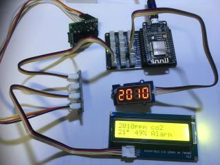

# Ausgabe von CO2, Temperatur, Luftfeuchte

  
[Testanordnung große Ansicht](assets/02_SCD30+LCD_Ausgabe_CO+Temp+Humidity+7Segment.jpg)

Hardware:  
NodeMCU  
SCD30  
LCD  
Grove 4-Digit Display mit TM1637  
