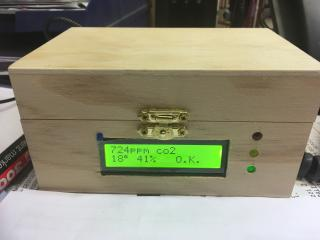
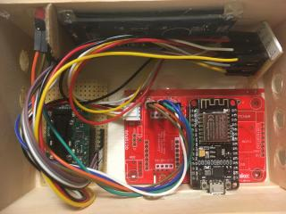

# Ausgabe von CO2, Temperatur, Luftfeuchte

  
[Testanordnung große Ansicht](assets/01_Einzelteile.jpg)  

Hardware:  
NodeMCU  
SCD30  
umgebautes LCD (ehemals mit Grove-Anschluss)
Octopus-Platine

Aus den Einzelteilen wurde ein erster Prototyp einer CO2-Ampel.  
  
[Die Box große Ansicht](assets/02_Box.jpg)  

  
[Innenansicht große Ansicht](assets/03_Innenansicht.jpg)  
